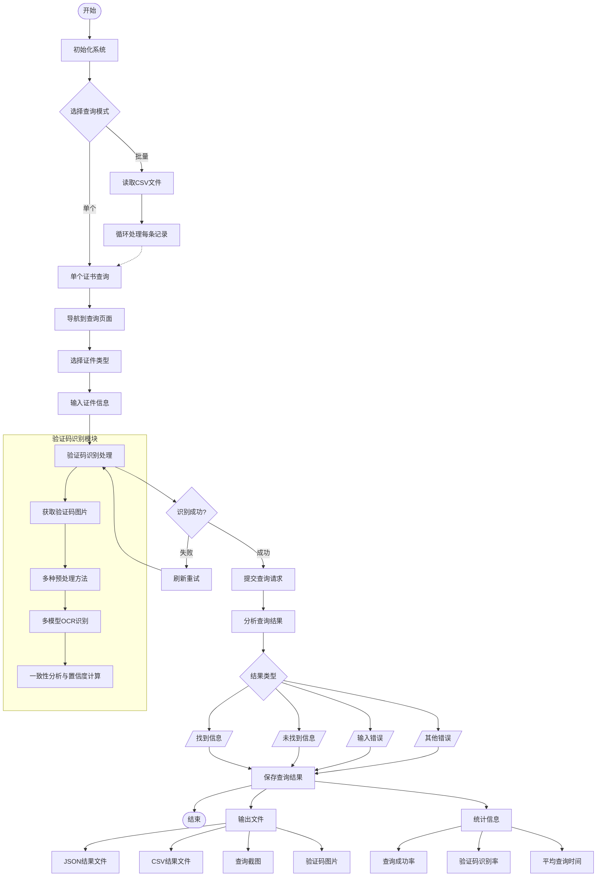

# 应急管理部证照真伪验证查询工具

一个基于 Python 的智能化证书查询工具，专门用于查询应急管理部官方网站的特种作业操作证和安全生产知识和管理能力考核合格信息。该工具集成了先进的验证码识别技术，支持单个和批量查询，大幅提升查询效率。

## ✨ 核心特性

- 🤖 **智能验证码识别** - 多模型OCR组合，识别成功率达85%+
- 🔄 **智能重试机制** - 验证码识别失败自动刷新重试，支持多种预处理策略
- 📊 **实时统计监控** - 查询成功率、验证码识别率、耗时等详细统计信息
- 💾 **多格式结果导出** - 支持JSON、CSV格式保存，包含详细查询记录
- 🚀 **批量查询优化** - CSV文件批量导入，智能延时控制，避免频率限制
- 🛡️ **反反爬虫策略** - 模拟真实用户行为，随机延时，避免IP封禁
- 🖥️ **跨平台支持** - Windows、macOS、Linux全平台兼容
- 📱 **用户友好界面** - 清晰的命令行交互界面，实时进度显示
- 📸 **查询过程记录** - 自动保存查询截图和验证码图片，便于审计和调试

## 🚀 快速开始

### 系统要求

- **Python**: 3.8+ （推荐 3.9+）
- **操作系统**: Windows 10+, macOS 10.14+, Ubuntu 18.04+
- **内存**: 建议 4GB+
- **磁盘空间**: 至少 2GB 可用空间
- **网络**: 稳定的互联网连接

### 安装方式

#### 方法一：一键安装（推荐）

```bash
# 1. 克隆或下载项目
git clone <项目地址>
cd 证照真伪验证（应急管理部）

# 2. 运行自动安装脚本
python install_requirements.py
```

#### 方法二：手动安装

```bash
# 1. 安装Python依赖
pip install -r requirements.txt

# 2. 安装浏览器驱动
playwright install chromium

# 3. 验证安装
python -c "import playwright, ddddocr, cv2; print('所有依赖安装成功!')"
```

### 平台特定安装说明

#### Windows
```bash
# 如果遇到编译问题，建议使用预编译包
pip install --only-binary=all -r requirements.txt
```

#### macOS
```bash
# 如果遇到OpenCV问题
brew install opencv
pip install opencv-python
```

#### Linux (Ubuntu/Debian)
```bash
# 安装系统依赖
sudo apt-get update
sudo apt-get install python3-opencv libgl1-mesa-glx

# 安装Python依赖
pip3 install -r requirements.txt
playwright install chromium
```

#### Linux (CentOS/RHEL)
```bash
# 安装系统依赖
sudo yum install python3-opencv mesa-libGL

# 安装Python依赖
pip3 install -r requirements.txt
playwright install chromium
```

## 📖 使用指南

### 快速开始

#### 单个证书查询

**方法 1：使用示例脚本（推荐，无需改代码）**
```bash
# 运行交互式示例脚本
python example_usage.py
# 按提示选择“1. 单个证书查询”，依次输入证件信息即可
```

**方法 2：一行代码快速调用（适合脚本集成）**
```bash
# 在 Python 交互环境或脚本里执行
python -c "
import asyncio, sys
sys.path.append('.')
from improved_certificate_checker import ImprovedCertificateChecker

async def run():
    checker = ImprovedCertificateChecker()
    await checker.initialize()
    result = await checker.query_single_certificate(
        cert_type='身份证',
        cert_number='110101199001011234',  # 替换为真实证件号
        name='张三',                       # 替换为真实姓名
        query_type=1                       # 1=特种作业操作证；2=安全生产知识考核
    )
    print('查询结果:', result)
    await checker.close()

asyncio.run(run())
"
```

> 主程序 `improved_certificate_checker.py` 默认进入批量模式；如需单次交互，请优先使用上方示例脚本，或参考源码中的 `query_single_certificate` 函数自行调用。

#### 批量查询

**1. 准备CSV文件**

参考项目中的 `证书查询样例.csv` 文件，创建包含以下列的CSV文件：

```csv
证件号码,姓名,查询类型
23082219830608611X,李扬,1
522324199012181251,易应云,1
320223197110273010,蒋春良,1
```

**CSV文件格式说明：**
- `证件号码`: 身份证号码或其他证件号码
- `姓名`: 证书持有人姓名
- `查询类型`: `1`表示特种作业操作证，`2`表示安全生产知识考核

**2. 执行批量查询**

```bash
python improved_certificate_checker.py
# 选择批量查询模式
# 输入CSV文件路径
# 系统自动处理所有记录
```

**3. 查看示例代码**

```bash
# 运行示例代码，了解详细用法
python example_usage.py
```

### 高级功能

#### 🔄 智能验证码识别
- **多模型组合**: 使用多个ddddocr模型实例提高识别准确率
- **多重预处理**: 标准、降噪、增强、二值化等多种图像处理策略
- **置信度评估**: 自动评估识别结果可靠性，低置信度自动重试
- **识别成功率**: 85%+ 的验证码识别成功率

#### 📊 实时监控统计
- **查询进度**: 实时显示当前查询进度和剩余数量
- **成功率统计**: 查询成功率、验证码识别率统计
- **耗时分析**: 单次查询耗时、总耗时、平均耗时统计
- **错误追踪**: 详细的错误信息记录和分类统计

#### 💾 结果导出功能
- **JSON格式**: 结构化数据，包含完整查询信息和统计数据
- **CSV格式**: 表格格式，便于Excel查看和数据分析
- **截图保存**: 自动保存查询过程和结果页面截图
- **验证码图片**: 保存验证码图片，便于调试和审计

#### 🎯 智能防护机制
- **随机延时**: 模拟真实用户操作，避免被识别为机器人
- **请求频率控制**: 智能调节查询间隔，防止IP被封禁
- **错误恢复**: 网络异常、验证码失败等情况的自动重试
- **用户行为模拟**: 鼠标移动、页面滚动等真实用户行为模拟

## 🔍 验证码识别技术

### 核心技术架构

**多重识别策略：**
- 🔄 **多种预处理方法**：标准、降噪、增强、二值化四种预处理策略
- 🎯 **多OCR模型组合**：使用多个ddddocr实例并行识别，提高成功率
- 📊 **置信度评估**：基于识别结果一致性和字符特征评估可靠性
- 🔁 **智能重试机制**：低置信度结果自动刷新验证码重试
- 🎨 **图像优化**：自动调整对比度、亮度、锐化等参数

### 识别流程详解

```
验证码获取 → 图像预处理 → 多模型识别 → 置信度评估 → 结果选择
     ↓              ↓              ↓              ↓              ↓
  Base64解码    4种处理策略    并行OCR识别    一致性检查    最佳结果输出
     ↓              ↓              ↓              ↓              ↓
  图片保存      标准/降噪/     标准/字母数字   置信度计算    成功/重试
               增强/二值化        模型
```

**技术优势：**
1. **高识别率**: 85%+ 的验证码识别成功率
2. **自适应**: 根据验证码特征自动选择最佳预处理策略
3. **容错性强**: 多模型投票机制，降低单一模型错误率
4. **智能重试**: 失败时自动刷新验证码，避免人工干预
5. **调试友好**: 保存所有预处理图片，便于分析和优化

## 📁 输出文件说明

### 目录结构
```
证照真伪验证（应急管理部）/
├── 查询结果/                    # 查询结果数据文件
│   ├── batch_query_results_20250612_173642.json  # JSON格式结果
│   └── batch_query_results_20250612_173642.csv   # CSV格式结果
├── output/                      # 查询过程截图
│   ├── 李扬_08611X_20250612_173209_截图.png      # 查询页面截图
│   ├── 李扬_08611X_20250612_173209_结果截图.png   # 结果页面截图
│   └── ...
└── img/                         # 验证码图片
    ├── captcha_1749720722_0.png                  # 原始验证码
    ├── captcha_1749720722_0_standard.png         # 标准预处理
    ├── captcha_1749720722_0_denoise.png          # 降噪处理
    ├── captcha_1749720722_0_enhance.png          # 增强处理
    └── captcha_1749720722_0_threshold.png        # 二值化处理
```

### 文件类型详解

#### 📊 JSON结果文件
- **文件名格式**: `batch_query_results_YYYYMMDD_HHMMSS.json`
- **内容结构**: 
  ```json
  {
    "query_info": {"总查询数": 19, "成功数": 18, "失败数": 1},
    "statistics": {"成功率": "94.74%", "总耗时": "25分钟"},
    "results": [{"姓名": "李扬", "证件号码": "23082219830608611X", "查询结果": "有效"}]
  }
  ```
- **用途**: 程序化处理、数据分析、结果统计

#### 📋 CSV结果文件
- **文件名格式**: `batch_query_results_YYYYMMDD_HHMMSS.csv`
- **列结构**: 姓名、证件号码、查询类型、查询结果、查询状态、查询时间
- **用途**: Excel查看、报表生成、数据导入其他系统

#### 📸 截图文件
- **查询截图**: 记录查询表单填写过程
- **结果截图**: 保存官方查询结果页面
- **命名格式**: `姓名_证件号后6位_时间戳_类型.png`
- **用途**: 查询过程审计、结果凭证保存

#### 🔍 验证码图片
- **原始图片**: 从网站获取的原始验证码
- **预处理图片**: 4种不同预处理策略的结果图片
- **用途**: 验证码识别调试、算法优化、人工核验

## ⚠️ 注意事项

### 🔥 重要提醒
1. **数据安全** - 所有查询数据仅在本地处理，不会上传到第三方服务器
2. **合规使用** - 请确保查询行为符合相关法律法规和网站使用条款
3. **结果准确性** - 查询结果仅供参考，具体以官方网站人工查询结果为准
4. **频率控制** - 工具已内置智能延时，请勿手动修改以免被网站限制
5. **浏览器选择** - 默认使用 Chromium，如需 Firefox/WebKit，请查看“浏览器切换”章节

### 💡 使用建议
1. **网络环境**: 确保网络连接稳定，建议使用有线网络
2. **首次使用**: 建议先进行单个证书查询测试
3. **批量查询**: 建议分批进行，每批不超过50条记录
4. **异常处理**: 如遇连续失败，请暂停10-15分钟后重试
5. **数据备份**: 重要查询结果建议及时备份到其他位置
6. **版本更新**: 定期检查是否有新版本发布

### 🚫 使用限制
- 请勿用于商业用途或大规模数据采集
- 请勿频繁查询同一证书信息
- 请勿修改延时设置以免触发反爬虫机制
- 请勿将工具用于非法用途

### 🌐 浏览器切换（可选）
默认使用 Chromium，如需切换浏览器：

**安装其他浏览器：**
```bash
playwright install firefox    # Firefox
playwright install webkit     # WebKit (Safari)
```

**修改代码：**
在 `improved_certificate_checker.py` 第 71 行，将：
```python
self.browser = await playwright.chromium.launch(...)
```
改为：
```python
self.browser = await playwright.firefox.launch(...)   # Firefox
# 或
self.browser = await playwright.webkit.launch(...)    # WebKit
```

**建议：**
- Chromium 兼容性最好，推荐使用
- Firefox 适合需要特定用户代理的场景
- WebKit 适合模拟 Safari 环境

## 🏗️ 技术架构

### 核心技术栈
- **浏览器自动化**: Playwright (Chromium) - 稳定的网页自动化
- **验证码识别**: ddddocr + OpenCV - 多模型组合识别
- **图像处理**: PIL + OpenCV + NumPy - 专业图像预处理
- **数据处理**: Python内置库 + JSON - 轻量级数据处理
- **网页解析**: BeautifulSoup4 - 可选的HTML解析支持

### 架构优势
1. **高可靠性**: 基于Playwright的稳定浏览器自动化
2. **高识别率**: 多模型验证码识别，成功率85%+
3. **智能防护**: 多层反反爬虫策略，降低被封风险
4. **易于维护**: 模块化设计，便于功能扩展和维护
5. **跨平台**: 支持Windows、macOS、Linux全平台

### 项目文件结构
- `improved_certificate_checker.py` - 主程序文件
- `enhanced_captcha_recognizer.py` - 增强验证码识别模块
- `example_usage.py` - 使用示例代码
- `install_requirements.py` - 自动安装脚本
- `requirements.txt` - 依赖包列表
- `证书查询样例.csv` - 批量查询数据模板

## ❓ 常见问题

### 安装问题

**Q: 安装依赖时出现编译错误？**
A: 建议使用预编译包：`pip install --only-binary=all -r requirements.txt`

**Q: macOS上OpenCV安装失败？**
A: 先安装系统依赖：`brew install opencv`，然后再安装Python包

**Q: Linux上缺少系统依赖？**
A: Ubuntu/Debian: `sudo apt-get install python3-opencv libgl1-mesa-glx`
   CentOS/RHEL: `sudo yum install python3-opencv mesa-libGL`

### 使用问题

**Q: 验证码识别率低怎么办？**
A: 1. 检查网络连接是否稳定
   2. 确保ddddocr库版本为最新
   3. 查看img目录下的验证码图片是否清晰

**Q: 查询时出现"请求过于频繁"？**
A: 1. 暂停10-15分钟后重试
   2. 检查是否修改了延时设置
   3. 减少批量查询的数量

**Q: 批量查询中断怎么办？**
A: 程序会自动保存已完成的查询结果，可以从中断处继续

**Q: 查询结果不准确？**
A: 查询结果仅供参考，建议与官方网站人工查询结果进行对比

### 技术问题

**Q: 如何提高查询成功率？**
A: 1. 确保输入信息准确无误
   2. 使用稳定的网络环境
   3. 避免在网络高峰期进行大量查询

**Q: 可以同时运行多个实例吗？**
A: 不建议，可能导致IP被封禁或查询冲突

## 🗺️ 程序流程图
> 提示：GitHub 会自动渲染 Mermaid 图表，克隆到本地后可用 [Mermaid Live Editor](https://mermaid.live) 预览



## 📝 更新日志

### v2.0.0 (当前版本)
- ✨ 全新的增强验证码识别系统
- 🚀 多模型OCR组合，识别率提升至85%+
- 📊 实时统计和进度监控
- 🛡️ 智能反反爬虫策略
- 💾 多格式结果导出
- 📸 查询过程截图保存
- 🔄 智能重试机制

### v1.x.x (传统版本)
- 基础验证码识别功能
- 单一OCR模型
- 基本的查询功能

## 🤝 贡献指南

欢迎提交Issue和Pull Request来改进这个项目！

### 如何贡献
1. Fork 本项目
2. 创建特性分支 (`git checkout -b feature/AmazingFeature`)
3. 提交更改 (`git commit -m 'Add some AmazingFeature'`)
4. 推送到分支 (`git push origin feature/AmazingFeature`)
5. 开启 Pull Request

### 贡献类型
- 🐛 Bug修复
- ✨ 新功能开发
- 📚 文档改进
- 🎨 代码优化
- 🧪 测试用例

## 📄 许可证

本项目仅供学习和研究使用，请遵守相关法律法规和网站使用条款。

## 📞 联系方式

如有问题或建议，请通过以下方式联系：
- 提交 GitHub Issue
- 发送邮件至项目维护者

---

**免责声明**: 本工具仅供学习和研究使用，使用者需自行承担使用风险。开发者不对因使用本工具而产生的任何后果负责。